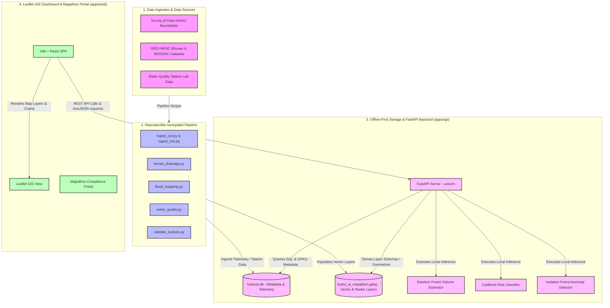

# 🌊 Hydro-AI Mapathon Edition
### *Flood Susceptibility Mapping, Water Source Identification & Water Quality Index (WQI) Analytics*

Hydro-AI is a production-ready, offline-first geospatial pipeline and digital twin dashboard configured for flood hazard assessment and public water resource management in Tamil Nadu, India (specifically optimized for **Kancheepuram** and surrounding districts). 

Developed for mapathons and geospatial compliance audits, it integrates Free and Open Source Software (FOSS) technologies, localized machine learning models, and interactive GIS visualization.

---

## 🏗️ System Architecture

The following diagram illustrates the end-to-end data ingestion, offline processing pipeline, backend analytics, and frontend GIS interface:



---

## 🌟 Key Features

- 🛰️ **Geospatial Pipeline**: Modular Python scripts using `GeoPandas`, `Rasterio`, and `Shapely` to download, process, and align Survey of India (SOI) boundaries, ISRO-NRSC raster data, and terrain models.
- 🌊 **Flood Susceptibility Mapping**: Computes 5-class flood hazard maps (Very Low, Low, Moderate, High, Very High) combining GIS weighted overlay and Local Random Forest models.
- 🔬 **Water Quality Index (WQI) Analytics**: Computes WQI using weighted sub-indices of 10 standard physical-chemical parameters (pH, turbidity, TDS, DO, BOD, COD, nitrate, fluoride, iron, coliform) with strict data validation rules.
- 🤖 **Offline Machine Learning Suite**:
  - **Random Forest Volume Estimator**: Predicts reservoir volume capacity from water spread surface area.
  - **CatBoost Risk Classifier**: Analyzes hydrological risk state (Normal, Moderate Risk, High Risk, Critical).
  - **Isolation Forest Anomaly Detection**: Tracks telemetry fluctuations for sensor health drift and chemical surges.
- 🗺️ **Interactive Digital Twin Dashboard**: Built using Vite + React, Leaflet, and Recharts to visualize watershed contours, water spread dynamics, and mapathon compliance reports.

---

## 🚀 Getting Started

This repository runs natively on Windows with **Miniconda** (configured for offline local environments, no Docker required).

### 1. Environment Setup

Launch Anaconda Prompt and activate the target conda environment:
```cmd
conda activate dgpu-core
```

### 2. Configure target District
Configure your `.env` file using the template `.env.example`:
```env
DISTRICT=Kancheepuram
DATABASE_URL=sqlite:///hydro_ai_mapathon.db
ALLOW_SYNTHETIC_DATA=TRUE
```

### 3. Run Ingestion and Analysis Pipeline
Run the reproducible pipeline scripts in order to ingest data, execute terrain analysis, and build output GeoPackages:
```cmd
python scripts/ingest_soi.py
python scripts/ingest_isro.py
python scripts/terrain_drainage.py
python scripts/flood_mapping.py
python scripts/water_sources.py
python scripts/water_quality.py
python scripts/validate_outputs.py
```
This generates the Mapathon GeoPackage output under `outputs/geopackage/hydro_ai_mapathon.gpkg`.

### 4. Run the Backend & Dashboard

To run the application locally:
1. **Start the FastAPI Backend**:
   ```cmd
   conda run -n dgpu-core uvicorn apps.api.main:app --host 127.0.0.1 --port 8000
   ```
2. **Start the React Frontend**:
   ```cmd
   npm install
   npm run dev
   ```
   Open `http://localhost:3000/` to inspect the Mapathon dashboard!

---

## 🧪 Running Tests

Ensure system reliability and conformance to GIS schemas using pytest:
```cmd
conda run -n dgpu-core pytest tests/
```

---

## 📄 Licensing & Compliance

### Software Licenses
- **Source Code**: Dual-licensed under the [Apache-2.0 License](file:///f:/hydroai-geospatial-dashboard%20%283%29/LICENSE).
- **Geospatial layers, print layouts, and reports**: Licensed under [Creative Commons Attribution-ShareAlike 4.0 (CC-BY-SA-4.0)](file:///f:/hydroai-geospatial-dashboard%20%283%29/LICENSE-CC-BY-SA-4.0).

### Policy Compliance
This project adheres to key Indian geospatial directives:
- **National Geospatial Policy (NGP) 2022**: Prioritizes open source software stack (GDAL, QGIS, Geopandas, Leaflet), uses non-restricted base boundaries, and publishes public data catalogs.
- **Indian Space Policy 2023**: Integrates with datasets hosted by ISRO (NRSC, MOSDAC, Bhuvan) while maintaining strict civilian-use boundaries (water security, flood disaster resilience, and agricultural planning).
- **No Sensitive Infrastructure**: Strictly masks and excludes high-resolution defense and national security installations in compliance with national security guidelines.

